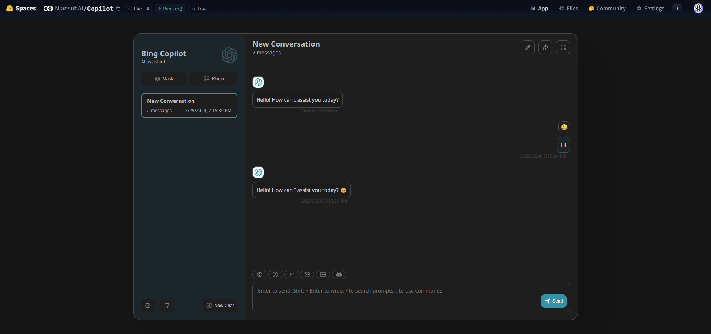

# Bingo OpenAI

In order to facilitate the integration of `new bing` into other `gpt`-like projects, the `API` interface in the `OpenAI` format is now open for everyone to call.

## Interface Description
### Enter parameters
  * url: /openai/chat/completions (PS: In order to facilitate compatibility with different projects, all requests ending with `/completions` will be supported)
  * Content-Type: application/json
  * Parameter Description
     * messages input message list, see https://platform.openai.com/docs/guides/gpt/chat-completions-api for the complete format
     * model model name (this field is used to specify the new bing style, and the parameter is one of Creative, Balanced, Precise, and gpt-4)
     * stream whether to use streaming output, the default is
    
### Output parameters
   * Content-Type: application/json or text/event-stream
   * Parameter Description
     * The message content returned by choices. For the complete format, see https://platform.openai.com/docs/guides/gpt/chat-completions-response-format

### Example
The following takes `curl` as an example
```
curl -kL 'https://niansuh-bingo.hf.space/api/v1/chat/completions' \
  -H 'Content-Type: application/json' \
  -d '{
    "messages":[{"role":"user","content":"Hello"}],
    "stream":true,
    "model":"Creative"
  }' \
--compressed
```

### limit
  * Only the chat (`/completions`) interface is currently supported. If you have any needs for other interfaces, please raise them in [issue](https://github.com/Niansuh/bingo/issues)
  * Due to new bing restrictions, custom history records are not currently supported.

## Calling method
In addition to calling new bing using HTTP POST requests, you can also call new bing using methods you are familiar with, such as python's openai library or packages of the same name in other languages. Here are some examples of how to use Python and Node.js

###Python
```
import openai
openai.api_key = "dummy"
openai.api_base = "https://niansuh-bingo.hf.space" # Here you can change it to a service deployed by yourself，bingo Service version required >= 0.9.0

# create a chat completion
chat_completion = openai.ChatCompletion.create(model="Creative", messages=[{"role": "user", "content": "Hello"}])

# print the completion
print(chat_completion.choices[0].message.content)
```

Streaming output
```
import openai
openai.api_key = "dummy"
openai.api_base = "https://niansuh-bingo.hf.space" # You can change this to your own deployed service. The bingo service version needs to be >= 0.9.0

# create a chat completion
completion = openai.ChatCompletion.create(model="Creative", stream=True, messages=[{"role": "user", "content": "Hello"}])
for chat_completion in completion:
    # print the completion
    print(chat_completion.choices[0].message.content, end="", flush=True)

```

> More instructions for use https://github.com/openai/openai-python

### Node.js
```
import OpenAI from 'openai';

const openai = new OpenAI({
  apiKey: 'dummy',
  baseURL: 'https://niansuh-bingo.hf.space' // You can change this to your own deployed service. The bingo service version needs to be >= 0.9.0
});

async function main() {
  const stream = await openai.chat.completions.create({
    model: 'Creative',
    messages: [{ role: 'user', content: 'Hello' }],
    stream: true,
  });
  for await (const part of stream) {
    process.stdout.write(part.choices[0]?.delta?.content || '');
  }
}

main();
```
> For more instructions, please refer to https://github.com/openai/openai-node


## 在线演示

1. https://huggingface.co/spaces/Niansuh/GPT4 [](https://huggingface.co/login?next=%2Fspaces%2FNiansuh%2FGPT4%3Fduplicate%3Dtrue%26visibility%3Dpublic)
2. https://huggingface.co/spaces/hf4all/chatgpt-next-web-bing 
[](https://huggingface.co/login?next=%2Fspaces%2Fhf4all%2Fchatgpt-next-web-bing%3Fduplicate%3Dtrue%26visibility%3Dpublic)


[](https://huggingface.co/spaces/Niansuh/GPT4)
